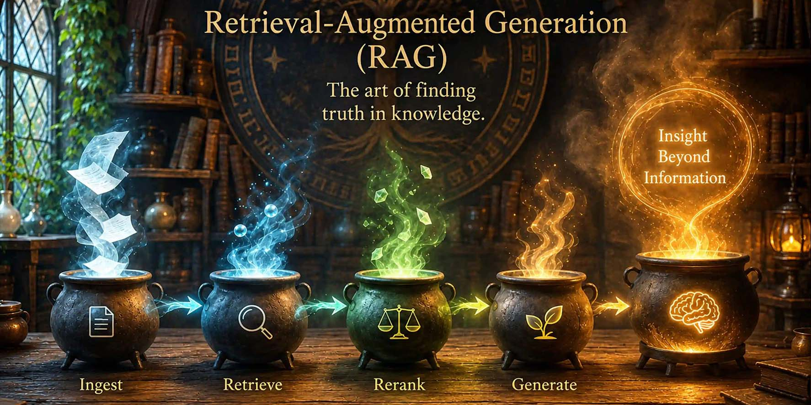

# 🧠 Local RAG Boilerplate (Universal Vector Engine)

<p align="center">
  
</p>

[](https://python.org)
[](https://python.langchain.com/)
[](https://github.com/chroma-core/chroma)
[](https://huggingface.co/BAAI/bge-m3)
[]()

## Production-grade RAG pipeline. 

Enterprise-grade RAG engine with an interactive pipeline monitor. Built with NiceGUI, featuring query preprocessing, dense retrieval, cross-encoder reranking, and token-constrained context assembly.

---

## 🏗️ Architectural Overview

Handling sensitive enterprise data requires zero tolerance for data leaks. This system operates on a cleanly **decoupled dual-pipeline architecture**, ensuring heavy ingestion tasks do not block runtime retrieval, and data never leaves the local machine.

## 🏗️ Architectural Overview

Handling sensitive enterprise data requires zero tolerance for third-party leaks. This system operates on a cleanly **decoupled dual-pipeline architecture**, ensuring heavy ingestion tasks do not block runtime retrieval, and data never leaves your local machine.

```text
=========================== INGESTION PIPELINE (OFFLINE) ===========================

                        [ Raw Domain PDFs ]
                                 │
                      ┌──────────▼──────────┐
                      │  01_ingest.py (ETL) │
                      └──────────┬──────────┘
                                 │ (Recursive Token Splitting: 750/100)
                      ┌──────────▼──────────┐
                      │  BAAI/bge-m3 Engine │ ◄─── High-Dimensional Normalization
                      └──────────┬──────────┘
                                 │ (1024-Dim Dense Vector Map)
                      ┌──────────▼──────────┐
                      │ Persistent ChromaDB │
                      └──────────▲──────────┘
                                 │ Low-Latency Cosine Similarity Search
                                 │
============================ RUNTIME RUNTIME WORKSPACE (UI) ============================
                                 │
                       [ User Semantic Query ]
                                 │
                      ┌──────────▼──────────┐
                      │   1. Processing     │ ◄─── query = processor.process_query()
                      └──────────┬──────────┘
                                 │
                      ┌──────────▼──────────┐
                      │   2. Retrieval      │ ◄─── retriever_service.search_knowledge_base()
                      └──────────┬──────────┘
                                 │ (Retrieved Chunks)
                      ┌──────────▼──────────┐
                      │   3. Reranking      │ ◄─── ranker.rerank() [Cross-Encoder Scoring]
                      └──────────┬──────────┘
                                 │
                      ┌──────────▼──────────┐
                      │   4. Context        │ ◄─── build_context(ranked_documents, 3100)
                      └──────────┬──────────┘
                                 │ (Token-Optimized Payload)
                      ┌──────────▼──────────┐
                      │ 5. LLM Generation   │ ◄─── result = prompt_model()
                      └──────────┬──────────┘
                                 │
                       [ UI Markdown Stream ]

```
### Core Technologies
* **Embeddings:** Utilizes `BAAI/bge-m3` (8,192 token context window) for state-of-the-art semantic mapping of complex nomenclature across any language or domain.
* **Vector Storage:** Local, SQLite-backed `ChromaDB` for persistent, high-speed vector retrieval.
* **Orchestration:** `LangChain` framework for document loading, recursive chunking, and pipeline management.
* **Query Processing:** Custom tokenization and normalization layers to extract explicit semantic parameters before hits are compiled.
* **Reranking Engine:** High-relevance cross-encoder sequence-pair modeling to minimize noise and reorganize core matches.
* **Context Assembly:** Capped sliding-window algorithm enforcing a maximum limit of 3,100 tokens to structurally minimize LLM hallucinations.
* **Interactive UI:** Built with `NiceGUI` to orchestrate an asynchronous, streaming layout complete with live visual phase indicators.
---

## 📁 Repository Structure

```text
RAG pipeline/
├── assets/                     # Graphic resources and design layout dependencies
├── data/
│   └── raw_pdfs/               # Source ingestion directory (drop target PDFs here)
├── scripts/                    # Core RAG execution steps
│   ├── __init__.py
│   ├── backend.py              # Business logic test file
│   ├── data_embedding.py       # Document ETL and vector initialization script
│   ├── query_processing_01.py  # Layer 1: Normalization & string sanitation
│   ├── retrieval_layer_02.py   # Layer 2: Local vector matrix extraction interface
│   ├── reranking_layer_03.py   # Layer 3: Cross-encoder sequence affinity re-scoring
│   ├── build_context_04.py     # Layer 4: Hard-capped sliding token allocation
│   └── llm_generation_05.py    # Layer 5: Prompt packing and inference delivery
├── services/                   # Application background support layers
│   ├── __init__.py
│   └── services.py             # Shared global pipeline connection hooks
├── vector_storage/             # Auto-generated SQLite ChromaDB data destination
├── config.py                   # Central environmental parameters and model paths
├── main.py                     # Primary asynchronous NiceGUI app layout router
└── requirements.txt            # Project platform dependencies registry                # System architecture and deployment documentation
```

## 🛠️ Installation & Setup
### Prerequisites

- Python 3.10+
- Minimum 8GB RAM (16GB+ recommended for massive PDF ingestion)

### 1. Clone & Navigate

```
    # Clone the repository
    git clone https://github.com/jeslor/rag_production.git

    # Enter project directory
    cd rag_production
```

### 2. Install Dependencies
Install your system dependencies:
```
    pip install -r requirements.txt
```
For pytesseract to work, you ALSO need system-level install:

```aiignore
macOS:
brew install tesseract

Ubuntu:
sudo apt-get install tesseract-ocr
Windows:

Install from installer:
https://github.com/UB-Mannheim/tesseract/wiki
```

## 🚀 Execution Guide
### Phase 1: Data Ingestion (ETL)
Place your target PDFs into data/raw_pdfs/. Then process them into your vector store:
````
    python scripts/step1_ingest.py
````
Note: The initial run requires an internet connection to securely cache the BAAI/bge-m3 model weights (~1.2GB) locally. All subsequent execution layers operate completely standalone and 100% offline.

### Phase 2: Semantic Retrieval
Once your local SQLite matrix database is compiled, execute the GUI App to start querying:
````
    python main.py
````
### 💬 Phase 3: Interactive Querying (Ask Your Knowledge Base)
Once the vector database has been built and populated, you can begin interacting with your private knowledge system through natural language queries.
The system uses a semantic similarity search over your local ChromaDB vector store, powered by BAAI/bge-large-en-v1.5, to retrieve the most contextually relevant document chunks.
 
🧠 Start Asking Questions depending on the documents you fed in
```aiignore
Search for something: What does the document say about data privacy?
Search for something: Summarize the onboarding process
Search for something: What are the compliance requirements for GDPR?
```


